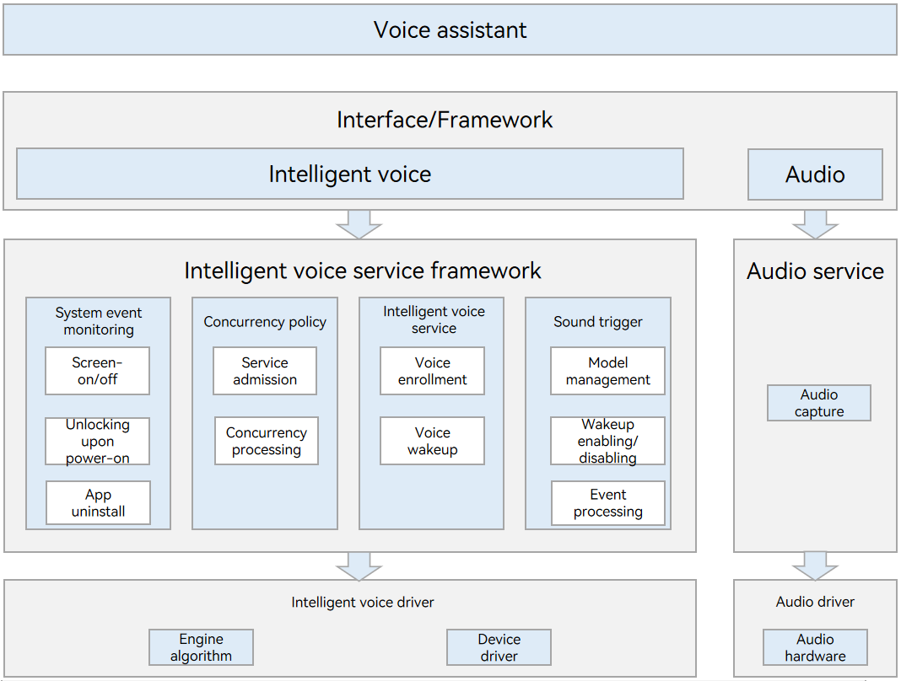

# Intelligent Voice Framework

## Overview

### Introduction

The intelligent voice framework consists of the intelligent voice service framework and intelligent voice driver. It implements voice enrollment and voice wakeup.

**Figure 1** Architecture of the intelligent voice framework



The intelligent voice service framework provides the following features:

- System event monitoring: monitoring system events such as unlocking upon power-on and screen-on/off
- Concurrency policy: intelligent voice service concurrency management

- Intelligent voice service: voice enrollment, voice wakeup, and more
- Sound trigger: Digital Signal Processor (DSP) model loading, DSP algorithm enabling/disabling, and DSP event processing

The intelligent voice driver provides the following features:

- Engine algorithm: intelligent voice algorithm engine and event reporting

- Device driver: DSP model loading/unloading, DSP algorithm enabling/disabling, event reporting, and hardware-related channel configuration

### Basic Concepts
- Voice enrollment: process of converting a wakeup word spoken by a user into an acoustic model and a voiceprint feature, which will be used for comparison during voice wakeup
- Voice wakeup: process of checking whether the current speaker is a registered user and if yes, waking up the system
- DSP chip: chip that implements digital signal processing

### Directory Structure

The structure of the repository directory is as follows:

```shell
/foundation/ai/intelligent_voice_framework  # Service code of the intelligent audio framework
├── frameworks                                      # Framework code
│   ├── native                                      # Internal API implementation
│   └── js                                          # External API implementation
├── interfaces                                      # API code
│   ├── inner_api                                   # Internal APIs
│   └── kits                                        # External APIs
├── sa_profile                                      # Service configuration profile
├├── services                                        # Service code
├── LICENSE                                         # License file
├── tests                                           # Developer test
└── utils                                           # Public functions
```

### Constraints

Currently, the intelligent voice framework supports the enrollment and wakeup of only one wakeup word.


## Available APIs
### APIs Used for Voice Enrollment

| API                                                    | Description          |
| ------------------------------------------------------------ | ------------------ |
| createEnrollIntelligentVoiceEngine(descriptor: EnrollIntelligentVoiceEngineDescriptor): EnrollIntelligentVoiceEngine | Creates an enrollment engine.    |
| init(config: EnrollEngineConfig): EnrollIntelligentVoiceEngineCallbackInfo | Initializes this enrollment engine.  |
| start(isLast: boolean): EnrollIntelligentVoiceEngineCallbackInfo | Starts enrollment.        |
| stop(): void                                                 | Stops enrollment.        |
| commit(): EnrollIntelligentVoiceEngineCallbackInfo           | Commits the enrollment data.    |
| setWakeupHapInfo(info: WakeupHapInfo): void                  | Sets the wakeup application information.|
| setSensibility(sensibility: SensibilityType): void           | Sets the sensitivity.      |
| release(): void                                              | Releases this enrollment engine.    |

### APIs Used for Voice Wakeup

| API                                                    | Description          |
| ------------------------------------------------------------ | ------------------ |
| createWakeupIntelligentVoiceEngine(descriptor: WakeupIntelligentVoiceEngineDescriptor): WakeupIntelligentVoiceEngine | Creates a wakeup engine.    |
| setWakeupHapInfo(info: WakeupHapInfo): void                  | Sets the wakeup application information.|
| setSensibility(sensibility: SensibilityType): void           | Sets the sensitivity.      |
| on(type: 'wakeupIntelligentVoiceEvent', callback: Callback<WakeupIntelligentVoiceEngineCallbackInfo>): void | Subscribes to wakeup events.    |
| release(): void                                              | Releases this wakeup engine.    |


## How to Develop

### Voice Enrollment

The voice enrollment process is an interaction process initiated by a user through the enrollment page of an application. The main process is as follows:
1. A user starts enrollment (creating and initializing the enrollment engine), and the enrollment page is displayed.
2. The enrollment page asks the user to speak a wakeup word, and the user speaks the wakeup word (starting enrollment). The enrollment page asks the user to speak the wakeup word again several times.
3. After the enrollment data is committed, the enrollment process is complete.
The code snippet is as follows:

```js
// Import the intelligentVoice module.
import intelligentVoice from '@ohos.ai.intelligentVoice';

// Obtain the intelligent audio management service.
var manager = intellVoice.getIntelligentVoiceManager();
if (manager == null) {
    console.error("Get IntelligentVoiceManager failed.");
} else {
    console.info("Get IntelligentVoiceManager success.");
    return;
}

// Create an enrollment engine.
var engine = null;
let engineDescriptor = {
    wakeupPhrase: '',                            // Set a wakeup word.
}
await intellVoice.createEnrollIntelligentVoiceEngine(engineDescriptor).then((data) => {
    engine = data;
    console.info('Create EnrollIntelligentVoice Engine finish');
}).catch((err) => {
    console.error('Create EnrollIntelligentVoice Engine failed, err: ' + err.message);
});
if (engine == null) {
    console.error('Create EnrollIntelligentVoice Engine failed');
    return;
}

// Initialize the enrollment engine.
let config = {
    language: "zh", // Chinese
    area: "CN", // China
}
engine.init(config).then((data) => {
    console.info('Init EnrollIntelligentVoice Engine finish');
}).catch((err) => {
    console.info('Init EnrollIntelligentVoice Engine failed, err: '+ err.message);
});

// Start enrollment.
let isLast = true; // The value true means that this is the last time to start enrollment, and false means the opposite. The value true is used here.
engine.start(isLast).then((data) => {
    console.info('Start enrollment finish');
}).catch((err) => {
    console.info('Start enrollment failed, err: '+ err.message);
});

// Commit the enrollment data.
engine.commit().then((data) => {
    console.info('Commit enroll result finish');
}).catch((err) => {
    console.info('Commit enroll result failed, err: '+ err.message);
});

// Deliver the voice wakeup application information.
let info = {
    bundleName: "demo", // Bundle name of the application. demo here is for reference only. Set this parameter based on your application.
    abilityName: "demo", // Ability name of the application. demo here is for reference only. Set this parameter based on your application.
}
engine.setWakeupHapInfo(info).then((data) => {
    console.info('Set wakeup hap info finish');
}).catch((err) => {
    console.info('Set wakeup hap info failed, err: '+ err.message);
});

// Release the enrollment engine.
engine.release().then((data) => {
    console.info('Release EnrollIntelligentVoice engine success.');
}).catch((err) => {
    console.info('Release EnrollIntelligentVoice engine failed, err: '+ err.message);
});
```

### Voice Wakeup

Voice wakeup is controlled by the intelligent voice framework. Upper-layer applications only need to create a wakeup engine by calling **createWakeupIntelligentVoiceEngine** and then subscribe to wakeup events.

```js
// Obtain the wakeup engine.
var engine = null;
let engineDescriptor = {
    needApAlgEngine: true, // Specify whether the framework needs to provide the AP algorithm engine.
    wakeupPhrase: '', // Set a wakeup word.
}
await intellVoice.createWakeupIntelligentVoiceEngine(engineDescriptor).then((data) => {
    engine = data;
    console.info('Create WakeupIntelligentVoice Engine finish');
}).catch((err) => {
    console.error('Create WakeupIntelligentVoice Engine failed, err: ' + err.message);
});
if (engine == null) {
    console.error('Create WakeupIntelligentVoice Engine failed');
    return;
}

// Subscribe to wakeup events.
engine.on('wakeupIntelligentVoiceEvent',(callback) => {
    console.info('wakeupIntelligentVoiceEvent CallBackInfo:')
    for (let prop in callback) {
        console.info('wakeupIntelligentVoiceEvent prop: ' + prop);
        console.info('wakeupIntelligentVoiceEvent value: ' + callback[prop]);
    }
});
```

## Repositories Involved

intelligent_voice_framework
