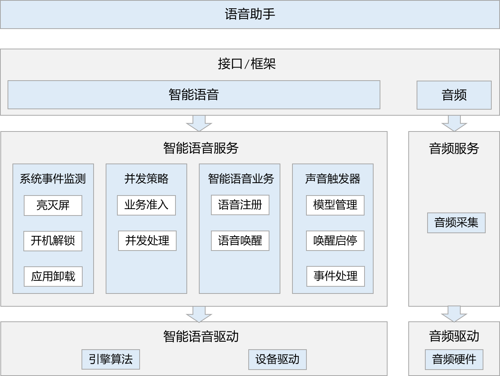

# 智能语音部件

## 概述

### 功能简介

智能语音组件包括智能语音服务框架和智能语音驱动，主要实现了语音注册及语音唤醒相关功能。

**图 1**  智能语音组件架构图



智能语音服务框架支持如下功能：
系统事件监测：开机解锁、亮灭屏等系统事件监测
并发策略：智能语音业务并发管理
智能语音业务：语音注册、语音唤醒等智能语音业务处理
声音触发器：DSP模型加载、DSP算法启停、DSP事件处理

智能语音驱动支持如下功能：
引擎算法：智能语音算法引擎以及事件上报
设备驱动：DSP模型加载卸载、算法启停、事件上报以及硬件相关通路配置

### 基本概念
- 语音注册：将用户说的唤醒词转换为声学模型以及声纹特征，以便后续的语音唤醒。
- 语音唤醒：判断当前说话人是否为已注册的特定用户。
- DSP：数字信号处理器（Digital Signal Processors），DSP芯片即指能够实现数字信号处理技术的芯片。

### 目录结构

仓目录结构如下：

```shell
/foundation/ai/intelligent_voice_framework  # 智能音频组件业务代码
├── frameworks                                      # 框架代码
│   ├── native                                      # 内部接口实现
│   └── js                                          # 外部接口实现
├── interfaces                                      # 接口代码
│   ├── inner_api                                   # 内部接口
│   └── kits                                        # 外部接口
├── sa_profile                                      # 服务配置文件
├── services                                        # 服务代码
├── LICENSE                                         # 证书文件
├── tests                                           # 开发者测试
└── utils                                           # 公共函数
```

### 约束与限制

- 智能语音服务当前只支持一个唤醒词的注册以及唤醒。

## 编译构建

在OpenHarmony源码根目录下，调用以下指令，单独编译intelligent_voice_framework。
```shell
./build.sh --product-name rk3568 --ccache --build-target intelligent_voice_framework --jobs 4
```
> **说明：** 
--product-name：产品名称，例如Hi3516DV300、rk3568等。
--ccache：编译时使用缓存功能。
--build-target: 编译的部件名称。
--jobs：编译的线程数，可加速编译。


## 接口说明
### 语音注册接口说明

|接口名称|接口描述|
|---|---|
|createEnrollIntelligentVoiceEngine(descriptor: EnrollIntelligentVoiceEngineDescriptor): EnrollIntelligentVoiceEngine|创建注册引擎。|
|init(config: EnrollEngineConfig): EnrollIntelligentVoiceEngineCallbackInfo|初始化注册引擎。|
|start(isLast: boolean): EnrollIntelligentVoiceEngineCallbackInfo|启动注册。|
|stop(): void|停止注册。|
|commit(): EnrollIntelligentVoiceEngineCallbackInfo|确认注册结果。|
|setWakeupHapInfo(info: WakeupHapInfo): void|设置唤醒应用信息。|
|setSensibility(sensibility: SensibilityType): void|设置灵敏度。|
|release(): void|释放注册引擎。|

### 语音唤醒接口说明

|接口名称|接口描述|
|---|---|
|createWakeupIntelligentVoiceEngine(descriptor: WakeupIntelligentVoiceEngineDescriptor): WakeupIntelligentVoiceEngine|创建唤醒引擎。|
|setWakeupHapInfo(info: WakeupHapInfo): void|设置唤醒应用信息。|
|setSensibility(sensibility: SensibilityType): void|设置灵敏度。|
|on(type: 'wakeupIntelligentVoiceEvent', callback: Callback<WakeupIntelligentVoiceEngineCallbackInfo>): void|订阅唤醒事件。|
|release(): void|释放唤醒引擎。|


## 开发实例

### 语音注册

语音注册流程是用户通过应用的注册界面主动发起的交互流程，主要流程如下：
1. 用户启动注册（创建注册引擎并初始化注册引擎）后，进入注册界面。
2. 界面提示用户说出唤醒词，用户根据提示说出相应唤醒词（启动注册），界面会让用户再次重复说出唤醒词，直到最后一次。
3. 注册完成（确认注册结果）后，注册流程全部完成。
示例代码如下：

```js
// 引入智能音频
import intelligentVoice from '@ohos.ai.intelligentVoice';

// 获取智能音频管理服务
var manager = intellVoice.getIntelligentVoiceManager();
if (manager == null) {
    console.error("Get IntelligentVoiceManager failed.");
} else {
    console.info("Get IntelligentVoiceManager success.");
    return;
}

// 创建注册引擎
var engine = null;
let engineDescriptor = {
    wakeupPhrase: '',                            // 设置唤醒词
}
await intellVoice.createEnrollIntelligentVoiceEngine(engineDescriptor).then((data) => {
    engine = data;
    console.info('Create EnrollIntelligentVoice Engine finish');
}).catch((err) => {
    console.error('Create EnrollIntelligentVoice Engine failed, err: ' + err.message);
});
if (engine == null) {
    console.error('Create EnrollIntelligentVoice Engine failed');
    return;
}

// 初始化注册引擎
let config = {
    language: "zh", // 中文
    area: "CN", // 中国
}
engine.init(config).then((data) => {
    console.info('Init EnrollIntelligentVoice Engine finish');
}).catch((err) => {
    console.info('Init EnrollIntelligentVoice Engine failed, err: '+ err.message);
});

// 启动注册
let isLast = true; // true: 最后一次启动，false: 非最后一次启动，实例为true
engine.start(isLast).then((data) => {
    console.info('Start enrollment finish');
}).catch((err) => {
    console.info('Start enrollment failed, err: '+ err.message);
});

// 确认注册结果
engine.commit().then((data) => {
    console.info('Commit enroll result finish');
}).catch((err) => {
    console.info('Commit enroll result failed, err: '+ err.message);
});

// 下发语音唤醒应用信息
let info = {
    bundleName: "demo", // 应用的bundle name，demo只是个参考例子，具体填写由应用确定
    abilityName: "demo", // 应用的ability name，demo只是个参考例子，具体填写由应用确定
}
engine.setWakeupHapInfo(info).then((data) => {
    console.info('Set wakeup hap info finish');
}).catch((err) => {
    console.info('Set wakeup hap info failed, err: '+ err.message);
});

// 释放注册引擎
engine.release().then((data) => {
    console.info('Release EnrollIntelligentVoice engine success.');
}).catch((err) => {
    console.info('Release EnrollIntelligentVoice engine failed, err: '+ err.message);
});
```

### 语音唤醒

语言唤醒由智能语音组件控制，上层应用只需要调用`createWakeupIntelligentVoiceEngine`获取唤醒引擎后注册唤醒事件回调即可。

```js
// 获取唤醒引擎
var engine = null;
let engineDescriptor = {
    needApAlgEngine: true, // 是否需要框架提供ap侧算法引擎
    wakeupPhrase: '', // 设置唤醒词
}
await intellVoice.createWakeupIntelligentVoiceEngine(engineDescriptor).then((data) => {
    engine = data;
    console.info('Create WakeupIntelligentVoice Engine finish');
}).catch((err) => {
    console.error('Create WakeupIntelligentVoice Engine failed, err: ' + err.message);
});
if (engine == null) {
    console.error('Create WakeupIntelligentVoice Engine failed');
    return;
}

// 注册事件回调
engine.on('wakeupIntelligentVoiceEvent',(callback) => {
    console.info('wakeupIntelligentVoiceEvent CallBackInfo:')
    for (let prop in callback) {
        console.info('wakeupIntelligentVoiceEvent prop: ' + prop);
        console.info('wakeupIntelligentVoiceEvent value: ' + callback[prop]);
    }
});
```

## 相关仓

intelligent_voice_framework
